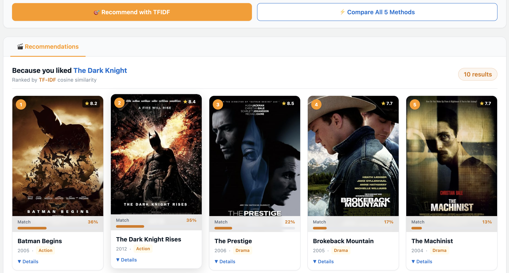
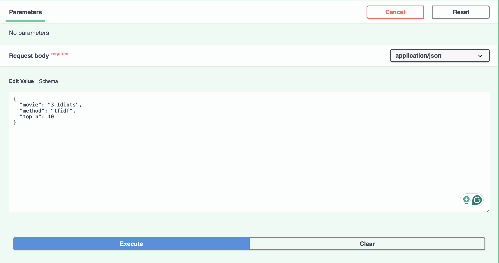
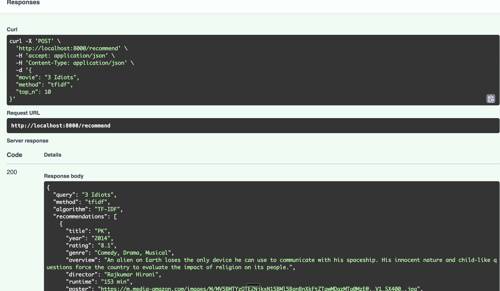

# CineMatch — Movie Recommender (5 Embedding Methods)

Compare **5 classic text-to-numbers methods** side-by-side on 1,000 IMDB movies.
Built for the **Text to Numbers** session of [Zero to GenAI Engineer](../../README.md).

The core insight: every method converts text → numbers, then uses **cosine similarity** to find similar movies. The representation changes; the similarity measure is always the same.

| # | Method | Year | Key Idea |
|---|--------|------|----------|
| 1 | Bag of Words | 1954 | Count word occurrences → sparse vector |
| 2 | TF-IDF | 1972 | Weight rare words higher than common ones |
| 3 | Word2Vec (Google News, 300d) | 2013 | Pre-trained semantic vectors from 100B words |
| 4 | GloVe (Wikipedia, 50d) | 2014 | Global co-occurrence statistics from 6B words |
| 5 | FastText (Wiki News, 300d) | 2016 | Pre-trained + character n-grams (handles OOV words) |

---

## Screenshots

### React App

*Movie recommendations for "The Dark Knight" using TF-IDF cosine similarity*

### FastAPI — Request (Swagger UI)

*Interactive API docs at `http://localhost:8000/docs` — try any movie and method*

### FastAPI — Response

*JSON response from `/recommend` — title, rating, genre, overview, and match score*

---

## Folder Structure

```
movie_recommender/
├── README.md                     ← this file
├── backend/
│   ├── main.py                   ← FastAPI server (5 endpoints)
│   ├── recommender.py            ← all 5 embedding methods + similarity logic
│   ├── train_models.py           ← train custom Word2Vec/FastText from scratch
│   ├── requirements.txt          ← Python dependencies
│   ├── data/
│   │   ├── .gitkeep              ← folder tracked in git; CSV is gitignored
│   │   └── imdb_top_1000.csv     ← ⚠️  put dataset here (not in git — see Step 1)
│   └── models/
│       ├── .gitkeep              ← folder tracked in git; model files are gitignored
│       ├── word2vec_movies.model ← generated by train_models.py (not in git)
│       └── fasttext_movies.model ← generated by train_models.py (not in git)
└── frontend/
    ├── src/
    │   ├── App.jsx
    │   └── components/           ← AlgorithmSelector, MovieCard, ComparisonChart, ...
    ├── package.json
    ├── vite.config.js            ← proxies /api/* → localhost:8000
    └── index.html
```

---

## Prerequisites

| Requirement | Minimum Version | Check |
|-------------|-----------------|-------|
| Python | 3.10+ | `python --version` |
| pip | latest | `pip --version` |
| Node.js | 18+ | `node --version` |
| npm | 9+ | `npm --version` |
| Disk space | ~3 GB | for pre-trained model downloads |
| RAM | 4 GB+ | Word2Vec Google News model is ~3 GB in memory |

> **Low RAM?** The server gracefully falls back to TF-IDF if any large model fails to load. BoW + TF-IDF always work with no downloads required.

---

## Step 1 — Get the Dataset

The CSV is **not included** in this repo (data files are gitignored — keep data off GitHub).

1. Go to Kaggle: [IMDB Dataset of Top 1000 Movies and TV Shows](https://www.kaggle.com/datasets/harshitshankhdhar/imdb-dataset-of-top-1000-movies-and-tv-shows)
2. Click **Download** → extract the zip
3. Place the file at exactly this path:

```
movie_recommender/backend/data/imdb_top_1000.csv
```

You should see these columns: `Series_Title`, `Overview`, `Genre`, `Director`, `Star1–4`, `IMDB_Rating`, `Released_Year`, `Runtime`, `Poster_Link`.

---

## Step 2 — Backend Setup

```bash
# 1. Navigate into the backend folder
cd backend

# 2. (Recommended) Create and activate a virtual environment
python -m venv venv
source venv/bin/activate        # macOS / Linux
# venv\Scripts\activate         # Windows

# 3. Install all Python dependencies
pip install -r requirements.txt

# 4. Start the FastAPI server
uvicorn main:app --reload --port 8000
```

### What happens on first startup

The server loads all 5 models automatically. The first three (BoW, TF-IDF) build instantly from the CSV. The pre-trained vector models are downloaded via `gensim.downloader` and then **cached in `~/gensim-data/`** — so subsequent startups are fast.

| Model download | Size | Approx. time on 50 Mbps |
|----------------|------|-------------------------|
| GloVe `glove-wiki-gigaword-50` | ~66 MB | ~15 sec |
| FastText `fasttext-wiki-news-subwords-300` | ~958 MB | 3–5 min |
| Word2Vec `word2vec-google-news-300` | ~1.6 GB | 5–8 min |

Terminal output will show progress for each model:

```
📂 Loading movie data...
  [1/5] Building Bag-of-Words model...
  [2/5] Building TF-IDF model...
  [3/5] Loading pre-trained Google News Word2Vec (300d, ~1.6 GB, cached after first run)...
  [4/5] Loading pre-trained GloVe vectors (~66 MB, cached after first run)...
  [5/5] Loading pre-trained FastText wiki-news vectors (300d, ~958 MB, cached after first run)...
✅ All models ready — recommender is live!
```

Verify it's working:

```bash
curl http://localhost:8000/health
# → {"status": "ok", "movies_loaded": 1000}
```

---

## Step 3 — Frontend Setup

Open a **new terminal** (keep the backend running in the first one):

```bash
# 1. Navigate into the frontend folder
cd frontend

# 2. Install Node.js dependencies (~60 MB, stored in node_modules/)
npm install

# 3. Start the dev server
npm run dev
```

Open your browser at: **http://localhost:3000**

The frontend automatically proxies all `/api/*` requests to `http://localhost:8000` (configured in `vite.config.js`). No manual URL setup needed.

---

## How to Retrain Models from Scratch

Instead of the large pre-trained vectors, you can train Word2Vec and FastText **directly on the 1,000 movie descriptions**. This takes seconds and teaches you exactly how the algorithms work.

```bash
# Run from the backend/ directory (with your venv activated)
python train_models.py
```

This will:
1. Load and tokenize the movie CSV
2. Train a 100-dimensional Word2Vec model (CBOW, window=5, 20 epochs)
3. Train a 100-dimensional FastText model (with character n-grams min_n=3, max_n=6)
4. Save both to `backend/models/`
5. Run a reload demo and similarity test

You can tune these parameters inside `train_models.py`:

| Parameter | Default | Effect |
|-----------|---------|--------|
| `vector_size` | 100 | Dimensions of each word vector |
| `window` | 5 | Words of context left/right |
| `epochs` | 20 | Training passes over corpus |
| `sg` | 0 (CBOW) | Set to `1` for Skip-gram |
| `min_n` / `max_n` | 3 / 6 | Character n-gram range (FastText only) |

---

## How to Load a Saved Custom Model

After running `train_models.py`, reload in any Python session:

```python
from gensim.models import Word2Vec, FastText

# Load Word2Vec
w2v = Word2Vec.load("models/word2vec_movies.model")
wv  = w2v.wv          # wv = KeyedVectors (the actual embedding lookup table)

print(wv["action"])                      # 100-dimensional numpy array
print(wv.most_similar("thriller", topn=5))

# Load FastText
ft  = FastText.load("models/fasttext_movies.model")
ftv = ft.wv

print(ftv["cinematographic"])            # ✅ works even for out-of-vocabulary words
                                         # FastText builds the vector from character n-grams
```

To swap a custom model into the recommender, edit `recommender.py`'s `_build_word2vec()` or `_build_fasttext()` (see the full instructions at the bottom of `train_models.py`).

---

## How to Use Pre-trained GloVe / FastText via Gensim

The recommender downloads these automatically on startup. To use them in your own code:

```python
import gensim.downloader as api

# ── GloVe (Stanford, 50d, trained on 6B Wikipedia words) ──────────────────
# Downloads ~66 MB once, then cached in ~/gensim-data/
glove = api.load("glove-wiki-gigaword-50")

print(glove["action"])                          # 50-dimensional numpy array
print(glove.most_similar("hero", topn=5))       # semantically similar words
print(glove.similarity("comedy", "humor"))      # cosine similarity between two words

# ── FastText (Facebook, 300d + character n-grams, Wikipedia + news) ────────
# Downloads ~958 MB once, then cached in ~/gensim-data/
fasttext = api.load("fasttext-wiki-news-subwords-300")

print(fasttext["cinematography"])               # works even for rare words
print(fasttext.most_similar("thriller", topn=5))

# ── Word2Vec (Google News, 300d, 3M vocab, 100B words) ─────────────────────
# Downloads ~1.6 GB once, then cached in ~/gensim-data/
word2vec = api.load("word2vec-google-news-300")

print(word2vec.most_similar("king", topn=5))
# Classic analogy: king - man + woman ≈ queen
result = word2vec.most_similar(positive=["king", "woman"], negative=["man"], topn=1)
print(result)  # → [('queen', 0.71...)]

# List all models available for download:
print(list(api.info()["models"].keys()))
```

All models are cached in `~/gensim-data/` after the first download. Subsequent loads are instant.

---

## API Reference

Base URL: `http://localhost:8000`  ·  Interactive docs: `http://localhost:8000/docs`

| Endpoint | Method | Request body | Response |
|----------|--------|-------------|---------|
| `/health` | GET | — | `{"status": "ok", "movies_loaded": 1000}` |
| `/movies` | GET | — | `{"movies": ["The Dark Knight", ...]}` — all 1000 titles |
| `/algorithms` | GET | — | Metadata dict for each of the 5 methods |
| `/recommend` | POST | `{"movie": "...", "method": "tfidf", "top_n": 10}` | Top-N similar movies with scores |
| `/compare` | POST | `{"movie": "...", "top_n": 8}` | All 5 methods side-by-side |

Valid `method` values: `bow` · `tfidf` · `word2vec` · `glove` · `fasttext`

### Example request

```bash
curl -X POST http://localhost:8000/recommend \
  -H "Content-Type: application/json" \
  -d '{"movie": "The Dark Knight", "method": "tfidf", "top_n": 5}'
```

---

## Troubleshooting

| Problem | Fix |
|---------|-----|
| `FileNotFoundError: imdb_top_1000.csv` | Download the Kaggle dataset and place it in `backend/data/` |
| `ModuleNotFoundError: certifi` | Run `pip install -r requirements.txt` again (or activate your venv first) |
| `ModuleNotFoundError: fastapi` | You're not in the venv — run `source venv/bin/activate` |
| Word2Vec download fails / takes too long | Poor connection; server falls back to TF-IDF automatically |
| Frontend shows "Could not connect to API" | Backend isn't running — start it with `uvicorn main:app --reload --port 8000` |
| Port 8000 already in use | `uvicorn main:app --port 8001` then update `vite.config.js` proxy target to `8001` |
| `npm: command not found` | Install Node.js 18+ from [nodejs.org](https://nodejs.org) |
| `npm install` fails | Delete `node_modules/` and `package-lock.json`, then re-run `npm install` |
